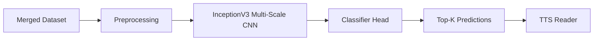
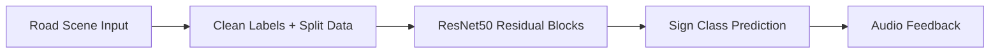
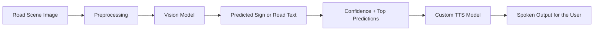

<!-- HEADER ANIMATION -->
<p align="center">
  
</p>

<h1 align="center">Blind Assistance Road Sign Reader</h1>

<p align="center">
  
</p>

---

## 🚀 Project Overview

This project is an **assistive vision system for blind and visually impaired users**.  
Instead of generating a general image caption, the system focuses on useful road-scene information such as:

- Traffic signs
- Traffic lights
- Stop signs
- Road signs
- Distance or direction text
- Important written information on the street

The system predicts what appears in the image, then reads the result aloud using our **custom-trained TTS model**, so the user can hear the output while walking.

---

## ✨ Key Features

- 🖼️ Upload road-scene images through a GUI notebook interface
- 🚦 Recognize traffic lights and road signs
- 🛑 Detect important sign classes such as `stop sign`, `traffic light`, and `traffic sign`
- 🔁 Apply the same updated pipeline across five deep learning models
- 📊 Compare models using accuracy, top-k accuracy, and prediction confidence
- 🔊 Convert model output into speech using a custom-trained TTS model
- 🌍 Support spoken feedback for blind-assistance use cases

---

## 🧠 Models Used

| Model | Role in the project |
|------|----------------------|
| ⚡ EfficientNetB0 | Strong and efficient CNN backbone for sign recognition |
| 🧬 InceptionV3 | Multi-scale CNN feature extraction |
| 🔍 ResNet50 | Residual CNN baseline for robust visual learning |
| 📱 MobileNet | Lightweight model suitable for mobile/edge deployment |
| 🤖 Transformer + Hybrid ConvNeXt | Attention-based hybrid experiment for stronger feature learning |

---
## ⚡ EfficientNetB0 Notebook

EfficientNetB0 is used as a compact high-performance image backbone.  
The notebook loads the merged dataset, prioritizes road-sign labels, trains the model, saves the mappings, and connects the prediction result to the GUI and TTS flow.

<p align="center">
  
</p>


---

## 🧬 InceptionV3 Notebook

InceptionV3 extracts image features at multiple visual scales, which is useful for road scenes where signs may appear at different sizes and distances.



---

## 🔍 ResNet50 Notebook

ResNet50 is used as a residual-learning baseline.  
It helps compare whether deeper residual CNN features improve road-sign classification and generalization.



---

## 📱 MobileNet Notebook

MobileNet is the lightweight experiment.  
It is useful for future deployment on mobile devices or real-time assistive systems where speed and model size matter.

<p align="center">
  
</p>

---

## 🤖 Transformer + Hybrid ConvNeXt Notebook

The Transformer + Hybrid ConvNeXt experiment combines stronger visual feature extraction with attention-based learning.  
This model is included to test whether a hybrid architecture can improve recognition of signs, signals, and written road information.

<p align="center">
  
</p>


---

## ⚙️ Full Pipeline



---

## 🌐 Data Collection and Preparation

We built a task-specific dataset by combining road-sign scraping with blind-assistance visual data.

### 📡 Sources

- OpenImages road-safety classes
- Scraped sign and traffic-signal images
- VizWiz VQA samples for blind-assistance context

### 🧹 Preprocessing

- Convert images to RGB
- Resize images to `224 x 224`
- Apply model-specific preprocessing
- Remove invalid answers such as `unknown`, `unanswerable`, and `can't tell`
- Prioritize important road classes in the final label space

### 🏷️ Important Labels

```text
stop sign
traffic light
traffic sign
```

---

## 🖥️ GUI Interface

The GUI allows the user to:

- Upload an image
- Run the trained model
- View the predicted label
- View confidence and top predictions
- Generate spoken output using the TTS model

This makes the notebook closer to the real blind-assistance scenario: the user provides an image from the road, and the system reads the useful result aloud.

---

## 🔊 Text-to-Speech

After prediction, the output is passed to our **custom-trained TTS model**.  
The goal is not only to classify the image, but to make the prediction accessible through audio feedback.

Example:

```text
Prediction: traffic light
Audio output: "The answer is traffic light."
```

---

## 📊 Model Comparison

The project compares all five model families based on:

- Test accuracy
- Top-5 accuracy
- Confidence score
- Stability on road-sign images
- Suitability for future real-time deployment

Example EfficientNet result after fixing the dataset merge:

| Metric | Value |
| ------ | ----- |
| Test Accuracy | 57.4% |
| Test Top-5 Accuracy | 92.6% |

---

## 🛠️ Tech Stack

| Category | Tools |
| -------- | ----- |
| 🐍 Language | Python |
| 🔥 Deep Learning | TensorFlow / Keras |
| 🖼️ Computer Vision | EfficientNet, Inception, ResNet, MobileNet, ConvNeXt |
| 🧠 Attention Models | Transformer |
| 📦 Data Handling | Hugging Face Datasets, NumPy, Pillow |
| 🎨 Interface | Jupyter Notebook, ipywidgets |
| 🔊 Audio | Custom-trained TTS model |

---

## 📁 Project Structure

```bash
image-captioning/
│
├── models/
│   ├── UPDATED_EfficientNet.ipynb
│   ├── UPDATED2_Inception_With_Scraping_(2).ipynb
│   ├── Resnet.ipynb
│   ├── MobileNet notebook
│   └── Transformer + Hybrid ConvNeXt notebook
│
└── README.md
```

---

## ⚡ How to Run

```bash
git clone https://github.com/Aya-114/image-captioning.git
cd image-captioning
```

Then open one of the notebooks inside the `models/` folder and run the cells in order:

1. Load or scrape the dataset
2. Merge and preprocess the data
3. Train or load the selected model
4. Evaluate the model
5. Run the GUI cells
6. Upload an image and generate audio output

---

## 🎯 Future Work

- Add more road-sign and road-text images
- Improve OCR for distance and direction signs
- Add a real-time camera/mobile version
- Compare all five models in one final results table
- Improve Arabic and English TTS quality
- Deploy the best model for real blind-assistance use

---

## 💜 Credits

Developed by **Brain Not Found 404 Team** 🚀

### 👥 Team Members

- Ahmed Ashraf (Leader)
- Asmaa Mohamed
- Aya Alaa
- Doha Mohamed
- Sara Mohamed

<!-- FOOTER ANIMATION -->

<p align="center">
  
</p>

