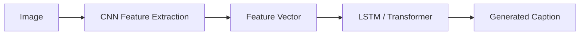

<!-- HEADER ANIMATION -->
<p align="center">
  
</p>

<h1 align="center">🧠 Image Captioning using Deep Learning</h1>

<p align="center">
  
</p>

---

## 🚀 Project Overview

This project presents an **end-to-end Image Captioning system** that converts images into meaningful natural language descriptions.

### ✨ Key Features
- 🖼️ Extract image features using multiple CNN architectures
- 🧠 Generate captions using sequence models
- 🔁 Compare multiple deep learning models
- 🌐 Build a custom dataset using web scraping
- 🎨 GUI interface *(currently under development 🚧)*

---

## 🧠 Models Used

### 🔍 Feature Extraction (CNN)

| Model | Description |
|------|------------|
| 🖼️ VGG16 | Classic feature extractor |
| 🔍 ResNet50 | Deep residual learning |
| ⚡ EfficientNetB0 | Optimized performance |
| 🧬 InceptionV3 | Multi-scale feature extraction |

### 🧠 Caption Generation

| Model | Description |
|------|------------|
| 🧩 LSTM | Sequence generation baseline |
| 🤖 Transformer | Attention-based model |

---

## ⚙️ Pipeline


## 🌐 Data Collection (Scraping)

We built a **custom dataset** using web scraping techniques.

### 📡 Sources

* Pexels API
* Flickr API

### 🧹 Preprocessing

* Convert text to lowercase
* Remove noise and special characters
* Filter short or invalid captions
* Remove duplicates

### 🏷️ Caption Formatting

* Add `startseq` and `endseq` tokens
* Tokenization and sequence encoding

---

## 🖥️ GUI Interface

🚧 The graphical user interface (GUI) is currently under development.

Future updates will include:

* 🖼️ Image upload functionality
* ⚡ Real-time caption generation
* 🎯 Clean and interactive user interface

---

## 📊 Model Comparison

This project compares multiple architectures based on:

* Accuracy
* Caption quality
* Generalization ability

> 🧠 Goal: identify the best-performing model for image captioning.

---

## 🛠️ Tech Stack

| Category            | Tools               |
| ------------------- | ------------------- |
| 🐍 Language         | Python              |
| 🔥 Deep Learning    | TensorFlow / Keras  |
| 🧠 Optional         | PyTorch             |
| 🖼️ Computer Vision | OpenCV              |
| 🌐 Data Collection  | Web Scraping APIs   |
| 🎨 Interface        | Tkinter / Streamlit |

---

## 📁 Project Structure

```bash
project/
│
├── data/
│   ├── images/
│   ├── captions.csv
│
├── models/
│   ├── lstm_model.py
│   ├── transformer_model.py
│   ├── cnn_models.py
│
├── utils/
│   ├── preprocessing.py
│   ├── feature_extraction.py
│
├── scraping/
│   ├── scrape_images.py
│
├── gui/
│   ├── app.py   # coming soon 🚧
│
└── README.md
```

---

## ⚡ How to Run

```bash
git clone https://github.com/Aya-114/image-captioning.git
cd image-captioning
pip install -r requirements.txt
python main.py
```

---

## 🎯 Future Work

* Improve Transformer performance
* Complete and integrate the GUI
* Expand the scraped dataset
* Evaluate model outputs using BLEU and other captioning metrics

---

## 💜 Credits

Developed by **Brain Not Found 404 Team** 🚀

### 👥 Team Members

* Ahmed Ashraf (Leader)
* Asmaa Mohamed
* Aya Alaa
* Doha Mohamed
* Sara Mohamed

<!-- FOOTER ANIMATION -->

<p align="center">
  
</p>
```
